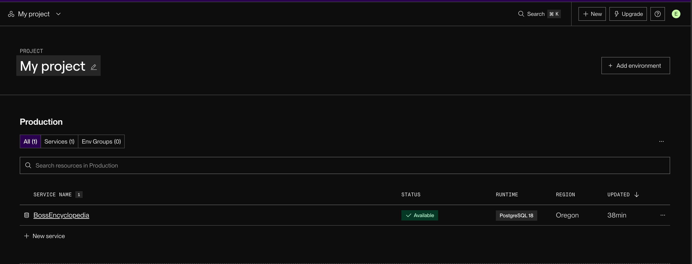

# WEB103 Project 2 - BOSS EncyloPedia 😈

Submitted by: Kritazya Upreti

About this web app: **This web app is a video game boss encyclopedia built using Node.js, Express, and plain HTML. It displays a collection of at least five bosses, each shown as a styled card with key attributes such as name, game, and difficulty. Users can click on each boss to view a dedicated detail page with full information, with routing handled dynamically using Express. The app is styled using PicoCSS and includes proper 404 handling for invalid routes.**

Time spent: **5** hours

## Required Features

The following **required** functionality is completed:

<!-- Make sure to check off completed functionality below -->

- [x] **The web app uses only HTML, CSS, and JavaScript without a frontend framework**
- [x] **The web app is connected to a PostgreSQL database, with an appropriately structured database table for the list items**
- [x] **NOTE: Your walkthrough added to the README must include a view of your Render dashboard demonstrating that your Postgres database is available**
- [x] **NOTE: Your walkthrough added to the README must include a demonstration of your table contents. Use the psql command 'SELECT \* FROM tablename;' to display your table contents.**

The following **optional** features are implemented:

- [x] The user can search for items by a specific attribute

The following **additional** features are implemented:

- [x] Dynamic boss detail pages routed by slug (`/bosses/:slug`), with custom 404 handling for invalid routes

## Video Walkthrough

Here's a walkthrough of implemented required features:

<!-- Replace this with whatever GIF tool you used! -->

GIF created with ... GIF tool here

<!-- Recommended tools:
[Kap](https://getkap.co/) for macOS
[ScreenToGif](https://www.screentogif.com/) for Windows
[peek](https://github.com/phw/peek) for Linux. -->

## Picture of Render Dashboard demonstrating that the Postgresql is available

## Picture of table of content of the database

## Notes

Describe any challenges encountered while building the app or any additional context you'd like to add.

## License

Copyright [yyyy] [name of copyright owner]

Licensed under the Apache License, Version 2.0 (the "License"); you may not use this file except in compliance with the License. You may obtain a copy of the License at

> http://www.apache.org/licenses/LICENSE-2.0

Unless required by applicable law or agreed to in writing, software distributed under the License is distributed on an "AS IS" BASIS, WITHOUT WARRANTIES OR CONDITIONS OF ANY KIND, either express or implied. See the License for the specific language governing permissions and limitations under the License.
